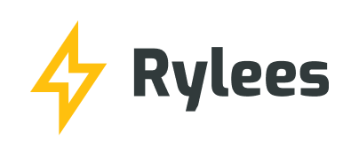
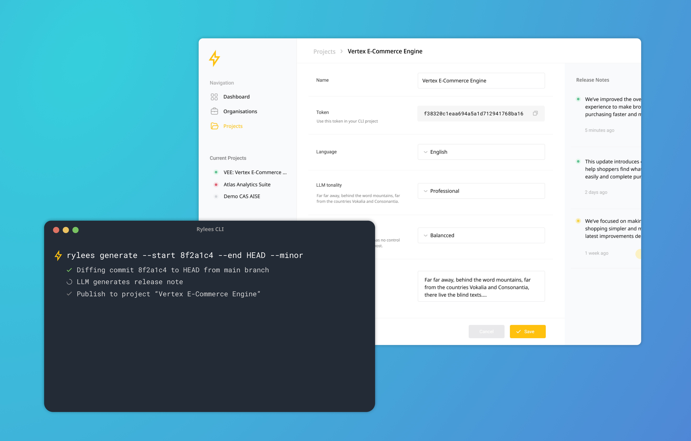
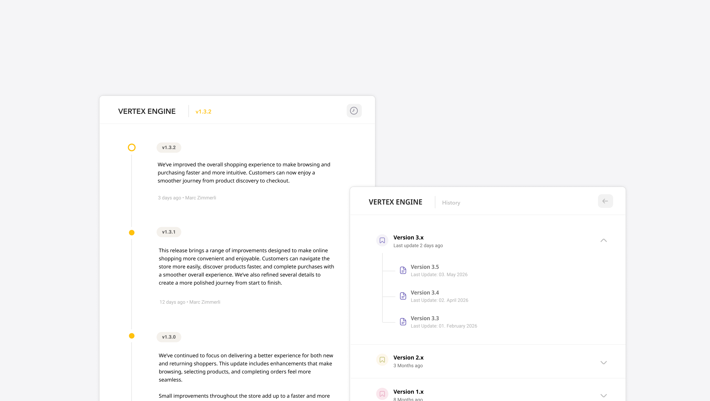

<p align="center">
    <picture>
        <source media="(prefers-color-scheme: dark)" srcset="assets/logo/rylees-gh-dark.png" width="380" height="160">
        <source media="(prefers-color-scheme: light)" srcset="assets/logo/rylees-gh-light.png" width="380" height="160">
        
    </picture>
</p>

# Rylees — Ship it. Explain it. Automatically.

Rylees bridges the gap between a developer's Git history and what customers actually need to know. It takes the code diffs and commit messages of a release cycle, runs them through an LLM/AI model, and produces a short readable summary — without the developer having to write a single sentence manually. The result can be reviewed, approved, and published to a per-project release history page that customers can visit at any time.

- **AI-generated release notes** from Git diffs and commit messages
- **Human-in-the-loop review** before anything goes live — accept, regenerate, or edit
- **Public release history** per project, accessible without an account
- **Multi-language support** — release notes can be translated to English, French and German on demand
- **Developer Console** to manage customers, projects, and API tokens

## Project Context

> Designed & engineered by human with love.<br>Made by AI.

This project was built as part of the CAS **AI-assisted Software Engineering** at [Fernfachhochschule Schweiz (FFHS)](https://www.ffhs.ch), led by **Werner Schäfer** and **Daniel Senften**. It serves as a practical demonstration of AI-assisted engineering across the full development lifecycle — from specification to implementation and deployment.

## The Platform

Rylees is useful for any team that ships software regularly but struggles to keep customers informed about what actually changed, turning the Git history you already produce into clear, customer-friendly summaries — no manual writing required. Each note is AI-shaped by per-project settings the developer defines: an **LLM tonality**, an **LLM temperature**, and a **project description** that together steer how the generated release note reads. Because every note also passes through human review before publishing, the developer stays in full control over tone, accuracy, and what goes live. The result is a maintained, multi-language release history that builds trust with your customers at almost no extra effort.

<p align="center">
    <picture>
        
    </picture>
</p>
    
## How It Works

The project is made up of three components that work together:

| Component                               | What it does                                                                                 |
| :-------------------------------------- | :------------------------------------------------------------------------------------------- |
| **CLI tool**                            | Runs on a developer's machine, reads the Git history, asks an LLM to draft the release note. |
| **Backend API**                         | Stores customers, projects, API tokens, and the published release history.                   |
| **Developer Console & Release History** | Web apps for managing projects and for customers to read what changed.                       |

Typical flow:

1. A developer registers an account and creates a **customer** and a **project** in the Developer Console.
2. Each project gets a unique **project token**; the developer holds a personal **API key**.
3. Inside a Git repository, the developer runs the CLI to generate a release note from a range of commits or tags.
4. The draft is reviewed (accept / regenerate / edit) and published.
5. Customers read the release notes on the project's public **Release History** page, optionally translated to EN / DE / FR.

## Getting Started — Register an Account

The Developer Console lives at **[console.rylees.ai](https://console.rylees.ai)**.

1. Register your account at **Register**
2. Log in. From **Account → API key**, copy your personal **API key** (used by the CLI).
3. Create a **customer**, then a **project** under it. Open the project to copy its **project token**.

You now have everything the CLI needs: your `API key` and the project's `token`.

## CLI — Installation & Usage

### Installation

The CLI requires **Python 3.12+** and is installed via pip:

```bash
pip install rylees
```

After installation the `rylees` executable is available on your `$PATH`:

```bash
rylees --version
```

### Configuration

The CLI reads its configuration from a `.env` file in the current working directory (where your /.git lives). A `.env.example` ships with the package — copy it and fill in your values:

```bash
# Required
RYLEES_API_TOKEN=<your personal API key from the console>
RYLEES_PROJECT_TOKEN=<the target project's token>
OPENAI_API_KEY=<your OpenAI API key>

# Optional (sensible defaults are applied)
RYLEES_LLM_MODEL=GPT-5.4
# RYLEES_LLM_TEMPERATURE=0.5   # overrides the project's configured temperature
```

The CLI fails fast with a clear message if any required variable is missing.

### Generating release notes

Run the CLI from inside the Git repository you want to document:

```bash
# Generate between two tags, bump the minor version (interactive review)
rylees generate --start v1.2.0 --end v1.3.0

# Generate between two commits, bump the patch version
rylees generate -s 8f2a1c4 -e HEAD --type commit --patch

# CI/CD: generate and publish immediately, skipping human review
rylees gen --start v1.2.0 --end v1.3.0 --publish
```

Common options:

| Option                | Description                                    | Default      |
| :-------------------- | :--------------------------------------------- | :----------- |
| `-s`, `--start`       | Start tag or commit hash                       | — (required) |
| `-e`, `--end`         | End tag or commit hash                         | `HEAD`       |
| `-t`, `--type`        | Interpret refs as `tag` or `commit`            | `tag`        |
| `--major/minor/patch` | Which version component to bump (exactly one)  | `--minor`    |
| `-p`, `--publish`     | ⚠ Skip the review step and publish immediately | off          |

### The review step (Human-in-the-loop)

Unless `--publish` is passed, the CLI prints the generated draft and waits for your decision:

```
─────────────────────────────────────────────────────────
Generated release note:

{draft text}

─────────────────────────────────────────────────────────
[A] Accept and publish   [R] Regenerate     [E] Edit
```

- **A** — publish the note; the CLI prints the resulting status and version (e.g. `1.3.0`).
- **R** — discard and regenerate a fresh draft.
- **E** — open the draft in your default editor; after saving you're brought back to the prompt.

Versions are computed server-side: the chosen bump is applied to the project's latest release note (starting from `0.0.0`).

## Release History — For Your Customers

Every published note appears on the project's public Release History page — no account required:

```
https://{customer-slug}.rylees.ai/{project-key}
```

Customers see a vertical timeline of releases (newest first) with a version badge, publication date, and the full note. A **DE / EN / FR** language switcher in the header translates the notes on demand (default: German).

<p align="center">
    <picture>
        
    </picture>
</p>

## AI Disclaimer

This project was built under heavy AI-assisted engineering. Architecture and technical specification were carefully crafted by the author, using AI as a thinking partner to challenge assumptions and sharpen decisions. The spec-driven implementation was largely written and orchestrated by AI.
