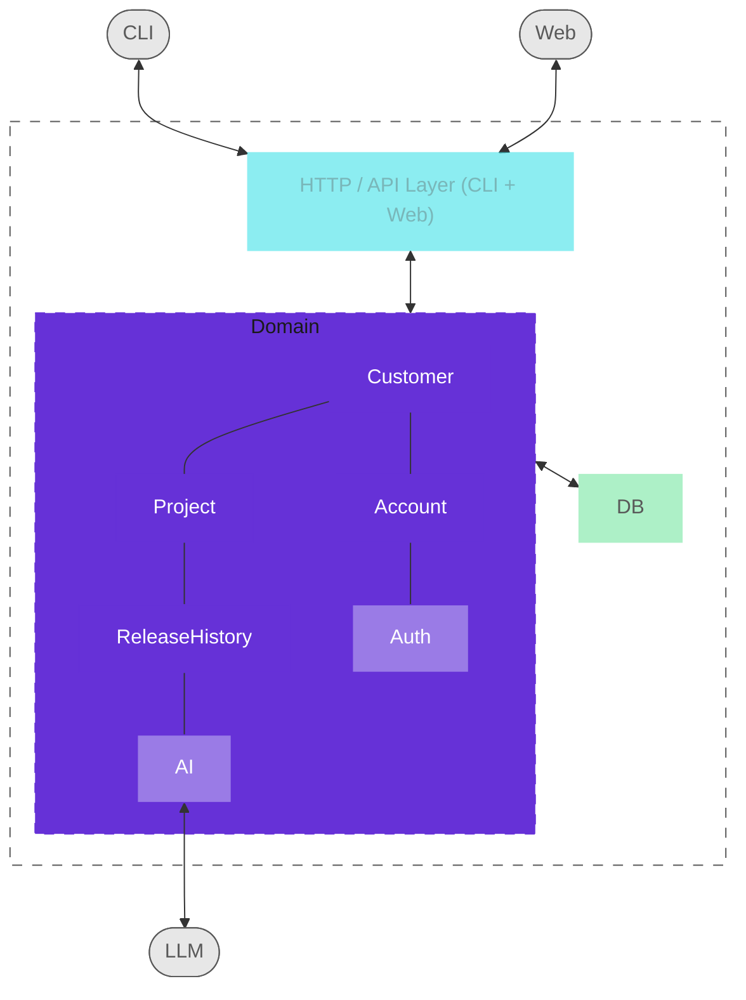

# Buildingblock API – System Overview

```mermaid
flowchart TB
    %% External clients / services
    CLI(["CLI"])
    Web(["Web"])
    LLM(["LLM"])

    %% Application boundary (unlabeled dashed box in original)
    subgraph APP[" "]
        direction TB
        API["HTTP / API Layer (CLI + Web)"]

        subgraph DOMAIN["Domain"]
            direction TB
            Customer["Customer"]
            Project["Project"]
            ReleaseHistory["ReleaseHistory"]
            Account["Account"]
            Auth["Auth"]
            AI["AI"]

            %% Domain associations (plain lines)
            Customer --- Project
            Project --- ReleaseHistory
            Account --- Auth
            Customer --- Account
            ReleaseHistory --- AI
        end

        DB["DB"]
    end

    %% Main data flows (bidirectional arrows)
    CLI <--> API
    Web <--> API
    API <--> DOMAIN
    DOMAIN <--> DB
    AI <--> LLM

    %% Styling to approximate the original colors
    classDef ext fill:#e7e7e7,stroke:#595959,color:#595959;
    classDef api fill:#41e2e8,stroke:#41e2e8,color:#595959,opacity:0.6;
    classDef domainEntity fill:#6631d7,stroke:#6631d7,color:#ffffff;
    classDef domainSoft fill:#9a7be6,stroke:#6631d7,color:#ffffff;
    classDef db fill:#adf0c7,stroke:#adf0c7,color:#595959;

    class CLI,Web,LLM ext;
    class API api;
    class Customer,Project,ReleaseHistory,Account domainEntity;
    class Auth,AI domainSoft;
    class DB db;

    style APP stroke:#595959,stroke-dasharray:8 8,fill:transparent;
    style DOMAIN stroke:#6631d7,stroke-dasharray:8 8,fill:#6631d7,color:#1a1a1a;
```
