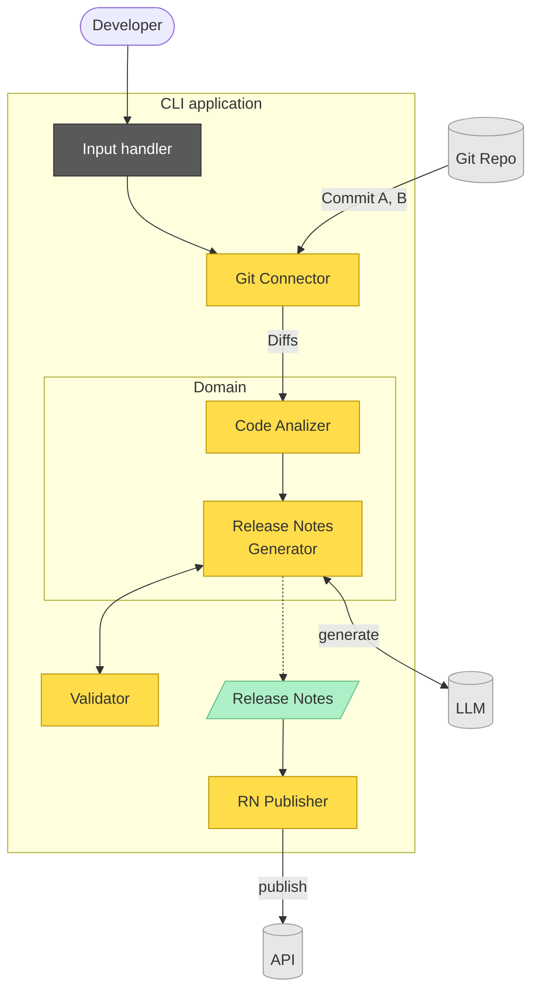

# CLI Application Workflow

## Legend

- **Yellow** – the application's own components (`Code Analizer`, `Release Notes Generator`, `Git Connector`, `Validator`, `RN Publisher`).
- **Grey** – external systems the CLI talks to (`Git Repo`, `LLM`, `API`).
- **Green** – the produced artifact (`Release Notes`).
- **Dark** – the CLI entry point (`Input Handler`).
- **Domain** subgroup – core business logic (analysis + generation), kept separate from the connectors/adapters.

## Flow

1. The **Developer** runs the CLI → `Input Handler`.
2. `Input Handler` triggers the `Git Connector`.
3. `Git Repo` supplies **Commit A, B** to the `Git Connector`.
4. `Git Connector` passes the **Diffs** to the `Code Analizer`.
5. `Code Analizer` hands its result to the `Release Notes Generator`.
6. The generator calls the **LLM** to *generate* text and runs the output through the `Validator` (both bidirectional).
7. The generator emits the **Release Notes** artifact.
8. `RN Publisher` *publishes* the notes to the external `API`.
