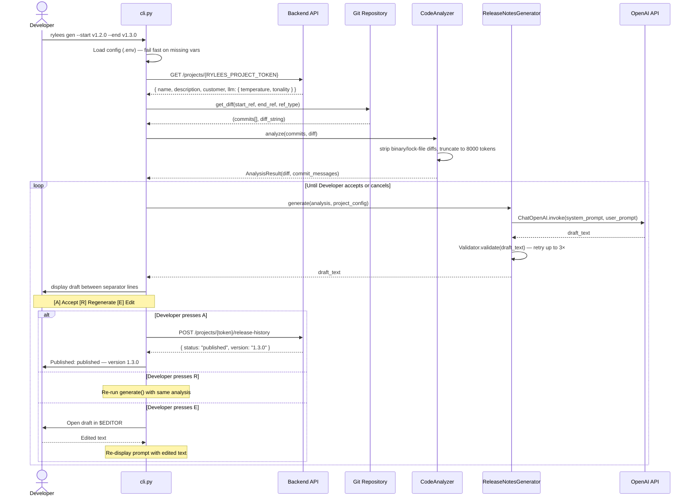

# Release Notes CLI – Generate Release Notes

UML sequence diagram for the CLI `generate` command workflow, including the HITL review loop and API publish call.

## Legend

| Element | Description |
| --- | --- |
| **CLI modules** | `cli.py`, `CodeAnalyzer`, `ReleaseNotesGenerator`, `Validator`, `RNPublisher` |
| **External services** | `Git Repository`, `OpenAI API`, `Backend API` |
| **Actor** | `Developer` |
| `->>` | Sync call |
| `-->>` | Sync response |

## Diagram

## Notes

- When `--publish` is passed, the HITL loop is skipped entirely. A warning is printed to stderr and the first valid draft is sent directly to the publish endpoint.
- The `Validator` checks that the draft is non-empty, ≥ 10 characters, and ≤ 2000 characters. After 3 consecutive failures a `GenerationError` is raised.
- Version computation is server-side: the CLI sends only `versionBump` (`major` / `minor` / `patch`), not the target version number.
