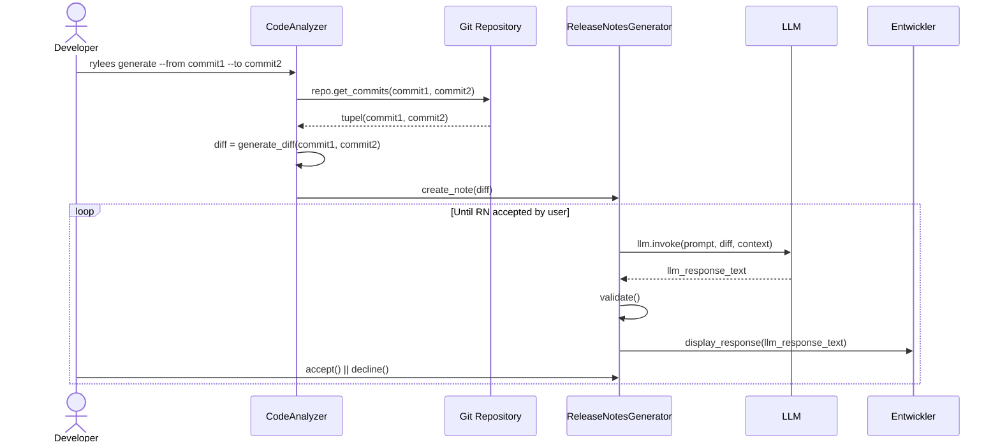

# Release Notes CLI – Generate Release Notes 

UML sequence diagram for CLI workflow to generate a release note.

## Legend

| Element | Description |
| --- | --- |
| **CLI module** | `CodeAnalyzer`, `ReleaseNotesGenerator` |
| **External services** | `Git Repository`, `LLM` |
| **Actor** | `Entwickler` |
| `->>` | Sync call |
| `-->>` | Sync response |

## Diagram

