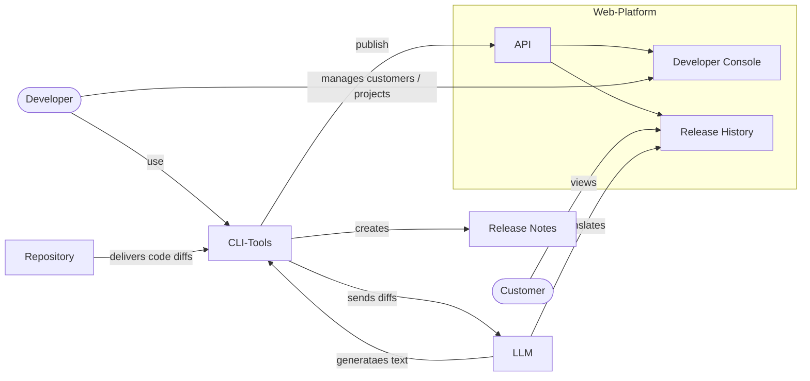

# System Overview

```mermaid
flowchart LR
    Developer(["Developer"])
    Repository["Repository"]
    LLM["LLM"]
    CLI["CLI-Tools"]
    ReleaseNotes["Release Notes"]
    Customer(["Customer"])

    subgraph WebPlattform["Web-Platform"]
        API["API"]
        DevConsole["Developer Console"]
        ReleaseHistory["Release History"]
        API --> DevConsole
        API --> ReleaseHistory
    end

    Developer -->|use| CLI
    Repository -->|"delivers code diffs"| CLI
    CLI -->|"sends diffs"| LLM
    LLM -->|"generataes text"| CLI
    CLI -->|creates| ReleaseNotes
    CLI -->|publish| API
    Developer -->|"manages customers / projects"| DevConsole
    Customer -->|views| ReleaseHistory
    LLM -->|translates| ReleaseHistory
```
