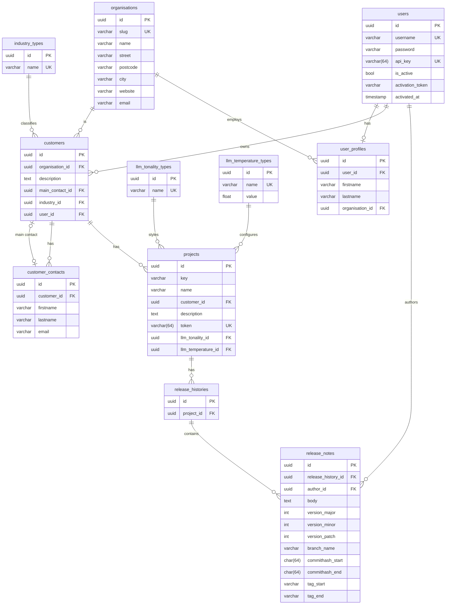

# Database Schema

Technical reference for the database.

## Overview

- A **user** (an application/agency user) manages one or more **customers** (their clients).
- Each customer has one or more **projects**.
- A project carries two LLM generation parameters: a **tonality** (writing style) and a **temperature** (sampling randomness).
- Every project accumulates **release histories**, and each release history holds **release notes** generated from git metadata (branch, commit-hash range, tag range, semantic version).
- Users have a **profile**, and profiles belong to a **organisation**.

> All primary keys are `uuid` unless noted otherwise.

> Every table **except** the `*_types` lookup tables carries audit columns at the end: `created_at`, `updated_at`, and `deleted_at`. `deleted_at` is a nullable soft-delete marker (`NULL` = active row). In Laravel terms these map to `timestamps()` + `softDeletes()`.

## Entity-Relationship Diagram

## Tables

### `projects`

A project belonging to a customer, configured with LLM tonality and temperature settings.

| Column               | Type           | Key | References                 | Notes                                          |
| -------------------- | -------------- | --- | -------------------------- | ---------------------------------------------- |
| `id`                 | `uuid`         | PK  |                            |                                                |
| `key`                | `varchar(255)` | UK* |                            | URL slug; unique per `customer_id`; auto-generated from `name` |
| `name`               | `varchar(255)` |     |                            |                                                |
| `customer_id`        | `uuid`         | FK  | `customers.id`             | Owning customer                                |
| `description`        | `text`         |     |                            |                                                |
| `token`              | `varchar(64)`  | UK  |                            | CLI auth/identification token; `Str::random(64)` on create |
| `llm_tonality_id`    | `uuid`         | FK  | `llm_tonality_types.id`    | Writing style preset                           |
| `llm_temperature_id` | `uuid`         | FK  | `llm_temperature_types.id` | LLM temperature preset                         |
| `created_at`         | `timestamp`    |     |                            |                                                |
| `updated_at`         | `timestamp`    |     |                            |                                                |
| `deleted_at`         | `timestamp`    |     |                            | Soft delete (`NULL` = active)                  |

> `projects.key` uniqueness is scoped to `customer_id`, not global. `projects.token` is globally unique.

### `customers`

A client managed by an application user.

| Column            | Type        | Key | References             | Notes                          |
| ----------------- | ----------- | --- | ---------------------- | ------------------------------ |
| `id`              | `uuid`      | PK  |                        |                                |
| `organisation_id` | `uuid`      | FK  | `organisations.id`     | Client organisation            |
| `description`     | `text`      |     |                        |                                |
| `main_contact_id` | `uuid`      | FK  | `customer_contacts.id` | Primary contact — **nullable** |
| `industry_id`     | `uuid`      | FK  | `industry_types.id`    | Customer industry              |
| `user_id`         | `uuid`      | FK  | `users.id`             | Managing application user      |
| `created_at`      | `timestamp` |     |                        |                                |
| `updated_at`      | `timestamp` |     |                        |                                |
| `deleted_at`      | `timestamp` |     |                        | Soft delete (`NULL` = active)  |

### `customer_contacts`

Contact persons belonging to a customer. A customer can have many contacts; the primary one is referenced by `customers.main_contact_id`.

| Column        | Type           | Key | References     | Notes                         |
| ------------- | -------------- | --- | -------------- | ----------------------------- |
| `id`          | `uuid`         | PK  |                |                               |
| `customer_id` | `uuid`         | FK  | `customers.id` | Owning customer               |
| `firstname`   | `varchar(255)` |     |                |                               |
| `lastname`    | `varchar(255)` |     |                |                               |
| `email`       | `varchar(255)` |     |                |                               |
| `created_at`  | `timestamp`    |     |                |                               |
| `updated_at`  | `timestamp`    |     |                |                               |
| `deleted_at`  | `timestamp`    |     |                | Soft delete (`NULL` = active) |

> **Design note:** `customers` ↔ `customer_contacts` form a deliberate circular reference (`customer_contacts.customer_id → customers.id` and `customers.main_contact_id → customer_contacts.id`). Keep `main_contact_id` **nullable** to avoid a chicken-and-egg insert: create the customer first, then its contacts, then set the main contact. Alternative pattern if you prefer to avoid the cycle: drop `main_contact_id` and add an `is_primary bool` flag on `customer_contacts`.

### `release_notes`

A generated release note tied to a release history, with git provenance and a semantic version.

| Column               | Type           | Key | References             | Notes                          |
| -------------------- | -------------- | --- | ---------------------- | ------------------------------ |
| `id`                 | `uuid`         | PK  |                        |                                |
| `release_history_id` | `uuid`         | FK  | `release_histories.id` | Parent release history         |
| `author_id`          | `uuid`         | FK  | `users.id`             | User who authored/triggered it |
| `body`               | `text`         |     |                        | Generated release-note content |
| `version_major`      | `int`          |     |                        | SemVer major                   |
| `version_minor`      | `int`          |     |                        | SemVer minor                   |
| `version_patch`      | `int`          |     |                        | SemVer patch                   |
| `branch_name`        | `varchar(255)` |     |                        |                                |
| `commithash_start`   | `char(64)`     |     |                        | Range start commit — nullable  |
| `commithash_end`     | `char(64)`     |     |                        | Range end commit — nullable    |
| `tag_start`          | `varchar(255)` |     |                        | Range start tag — nullable     |
| `tag_end`            | `varchar(255)` |     |                        | Range end tag — nullable       |
| `created_at`         | `timestamp`    |     |                        |                                |
| `updated_at`         | `timestamp`    |     |                        |                                |
| `deleted_at`         | `timestamp`    |     |                        | Soft delete (`NULL` = active)  |

> **Design note:** A release range can be expressed by **commit hashes** (`commithash_start`/`commithash_end`) **or** by **tags** (`tag_start`/`tag_end`). All four are nullable — populate one pair or the other, not necessarily both.

### `release_histories`

Groups release notes under a project.

| Column       | Type        | Key | References    | Notes                         |
| ------------ | ----------- | --- | ------------- | ----------------------------- |
| `id`         | `uuid`      | PK  |               |                               |
| `project_id` | `uuid`      | FK  | `projects.id` | Owning project                |
| `created_at` | `timestamp` |     |               |                               |
| `updated_at` | `timestamp` |     |               |                               |
| `deleted_at` | `timestamp` |     |               | Soft delete (`NULL` = active) |

> **Design decision:** Each `release_notes` row represents one complete release (hence `version_*` and the commit/tag range live there). `release_histories` is intentionally a thin grouping table, kept in place so release-level attributes (e.g. `title`, overall `description`) can be added later without a disruptive migration. Table and column names are kept as-is by team convention.

### `users`

Application users (authentication + activation).

| Column             | Type           | Key | References | Notes                                              |
| ------------------ | -------------- | --- | ---------- | -------------------------------------------------- |
| `id`               | `uuid`         | PK  |            |                                                    |
| `username`         | `varchar(255)` | UK  |            | Login identifier; email format                     |
| `password`         | `varchar(255)` |     |            | Bcrypt hash — never plaintext                      |
| `api_key`          | `varchar(64)`  | UK  |            | CLI auth key; `Str::random(64)` on registration    |
| `is_active`        | `bool`         |     |            | Default `false`; set `true` on activation          |
| `activation_token` | `varchar(255)` |     |            | Nullable — cleared after activation                |
| `activated_at`     | `timestamp`    |     |            | Nullable — set on activation                       |
| `created_at`       | `timestamp`    |     |            |                                                    |
| `updated_at`       | `timestamp`    |     |            |                                                    |
| `deleted_at`       | `timestamp`    |     |            | Soft delete (`NULL` = active)                      |

> `api_key` is used as a permanent CLI Bearer token. It is exposed only via `GET /users/me`, never in list responses.

### `user_profiles`

Personal details for a user, linked to a organisation. Holds the 1:1 FK back to its owning user.

| Column            | Type           | Key | References         | Notes                                 |
| ----------------- | -------------- | --- | ------------------ | ------------------------------------- |
| `id`              | `uuid`         | PK  |                    |                                       |
| `user_id`         | `uuid`         | FK  | `users.id`         | Owning user — `UNIQUE` (enforces 1:1) |
| `firstname`       | `varchar(255)` |     |                    |                                       |
| `lastname`        | `varchar(255)` |     |                    |                                       |
| `organisation_id` | `uuid`         | FK  | `organisations.id` |                                       |
| `created_at`      | `timestamp`    |     |                    |                                       |
| `updated_at`      | `timestamp`    |     |                    |                                       |
| `deleted_at`      | `timestamp`    |     |                    | Soft delete (`NULL` = active)         |

### `organisations`

An organisation entity, shared by both sides of the system: the agency's own org (referenced from `user_profiles.organisation_id`) **and** client organisations (referenced from `customers.organisation_id`).

| Column       | Type           | Key | References | Notes                                                        |
| ------------ | -------------- | --- | ---------- | ------------------------------------------------------------ |
| `id`         | `uuid`         | PK  |            |                                                              |
| `slug`       | `varchar(255)` | UK  |            | URL-safe slug; auto-generated from `name` on create/update   |
| `name`       | `varchar(255)` |     |            |                                                              |
| `street`     | `varchar(255)` |     |            | Nullable                                                     |
| `postcode`   | `varchar(20)`  |     |            | Nullable                                                     |
| `city`       | `varchar(255)` |     |            | Nullable                                                     |
| `website`    | `varchar(255)` |     |            | Nullable                                                     |
| `email`      | `varchar(255)` |     |            | Nullable                                                     |
| `created_at` | `timestamp`    |     |            |                                                              |
| `updated_at` | `timestamp`    |     |            |                                                              |
| `deleted_at` | `timestamp`    |     |            | Soft delete (`NULL` = active)                                |

> **Slug generation algorithm:** lowercase `name`, replace `/[^a-z0-9]+/` with `-`, trim `-` from both ends, check global uniqueness, append `-2`, `-3`, … until unique. Used for customer subdomains (`{slug}.rylees.ai`) in the public Release History SPA.

### `llm_tonality_types`

Lookup table of writing-style presets.

| Column | Type           | Key | Notes  |
| ------ | -------------- | --- | ------ |
| `id`   | `uuid`         | PK  |        |
| `name` | `varchar(255)` | UK  | Unique |

### `llm_temperature_types`

Lookup table of LLM temperature presets.

| Column  | Type           | Key | Notes                      |
| ------- | -------------- | --- | -------------------------- |
| `id`    | `uuid`         | PK  |                            |
| `name`  | `varchar(255)` | UK  | e.g. "precise", "creative" |
| `value` | `float`        |     | Numeric temperature value  |

### `industry_types`

Lookup table of customer industries.

| Column | Type           | Key | Notes  |
| ------ | -------------- | --- | ------ |
| `id`   | `uuid`         | PK  |        |
| `name` | `varchar(255)` | UK  | Unique |

## Relationships

| From                | Column               | →   | To                         | Cardinality           |
| ------------------- | -------------------- | --- | -------------------------- | --------------------- |
| `projects`          | `customer_id`        | →   | `customers.id`             | many-to-one           |
| `projects`          | `llm_tonality_id`    | →   | `llm_tonality_types.id`    | many-to-one           |
| `projects`          | `llm_temperature_id` | →   | `llm_temperature_types.id` | many-to-one           |
| `customers`         | `organisation_id`    | →   | `organisations.id`         | many-to-one           |
| `customers`         | `user_id`            | →   | `users.id`                 | many-to-one           |
| `customers`         | `industry_id`        | →   | `industry_types.id`        | many-to-one           |
| `customers`         | `main_contact_id`    | →   | `customer_contacts.id`     | one-to-one (nullable) |
| `customer_contacts` | `customer_id`        | →   | `customers.id`             | many-to-one           |
| `release_histories` | `project_id`         | →   | `projects.id`              | many-to-one           |
| `release_notes`     | `release_history_id` | →   | `release_histories.id`     | many-to-one           |
| `release_notes`     | `author_id`          | →   | `users.id`                 | many-to-one           |
| `user_profiles`     | `user_id`            | →   | `users.id`                 | one-to-one            |
| `user_profiles`     | `organisation_id`    | →   | `organisations.id`         | many-to-one           |

## Indexes

Every foreign-key column carries an index for join/lookup performance. Columns already marked `UNIQUE` (`users.username`, `user_profiles.user_id`, and `name` on each `*_types` table) get an implicit index from their constraint and are **not** duplicated below. Index names follow the Laravel default `{table}_{column}_index` convention.

| Index                                    | Table               | Column               |
| ---------------------------------------- | ------------------- | -------------------- |
| `projects_customer_id_index`             | `projects`          | `customer_id`        |
| `projects_llm_tonality_id_index`         | `projects`          | `llm_tonality_id`    |
| `projects_llm_temperature_id_index`      | `projects`          | `llm_temperature_id` |
| `customers_organisation_id_index`        | `customers`         | `organisation_id`    |
| `customers_main_contact_id_index`        | `customers`         | `main_contact_id`    |
| `customers_industry_id_index`            | `customers`         | `industry_id`        |
| `customers_user_id_index`                | `customers`         | `user_id`            |
| `customer_contacts_customer_id_index`    | `customer_contacts` | `customer_id`        |
| `release_notes_release_history_id_index` | `release_notes`     | `release_history_id` |
| `release_notes_author_id_index`          | `release_notes`     | `author_id`          |
| `release_histories_project_id_index`     | `release_histories` | `project_id`         |
| `user_profiles_organisation_id_index`    | `user_profiles`     | `organisation_id`    |

> Note: `user_profiles.user_id` is intentionally absent here — its `UNIQUE` constraint (`user_profiles_user_id_unique`) already provides the index.

## Infrastructure — Subdomain Routing

The platform uses three DNS records for `rylees.ai`:

| DNS record | Type | Target | Purpose |
| ---------- | ---- | ------ | ------- |
| `api.rylees.ai` | A | API server | Backend API |
| `console.rylees.ai` | A | Frontend server | Developer Console SPA |
| `*.rylees.ai` | A (wildcard) | Frontend server | Customer Release History subdomains |

Specific A records take precedence over the wildcard, so `api` and `console` are unaffected. The frontend server uses three nginx server blocks:

- `api.rylees.ai` → PHP-FPM proxied to Laravel (`public/index.php`)
- `console.rylees.ai` → serves `dist/console.html` as the SPA root
- `~^(?<subdomain>.+)\.rylees\.ai$` (wildcard, excludes `console` and `api`) → serves `dist/history.html`

The wildcard TLS certificate covers `*.rylees.ai`. `api.rylees.ai` and `console.rylees.ai` use their own certificates.

No DNS API calls are made when a customer is created — the `organisations.slug` is generated by the application, and the wildcard DNS + nginx configuration automatically makes `{slug}.rylees.ai` resolvable without any additional provisioning step.

## Notes & Data-Integrity Observations

1. **`users.password`**: ensure this column holds a bcrypt hash (`Hash::make()`), never plaintext.
2. **`users.api_key`**: generated via `Str::random(64)` on registration; used as a permanent CLI Bearer token. Must not appear in list responses.
3. **`projects.token`**: generated via `Str::random(64)` on project creation; must not appear in list responses.
4. **`organisations.slug`**: auto-generated from `name` on create; used to construct the public Release History subdomain URL.

## Naming Conventions

- Primary keys: `uuid` named `id`.
- Foreign keys: `<referenced_table_singular>_id` (e.g. `customer_id`, `project_id`).
- Indexes: `{table}_{column}_index`; unique constraints: `{table}_{column}_unique` (Laravel defaults).
- Lookup/enum tables: `<name>_types` (`llm_tonality_types`, `llm_temperature_types`, `industry_types`).
